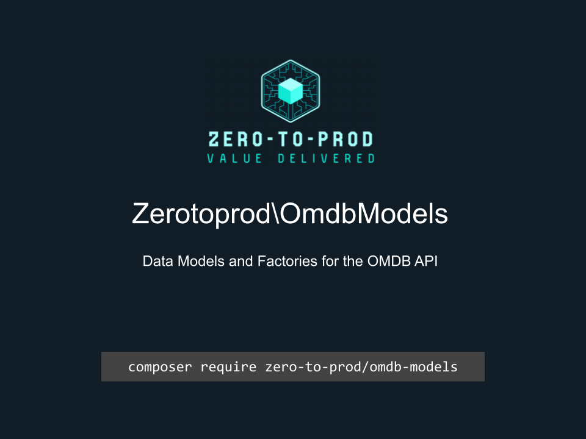

# Zerotoprod\OmdbModels



[](https://github.com/zero-to-prod/omdb)
[](https://github.com/zero-to-prod/omdb/actions)
[](https://packagist.org/packages/zero-to-prod/omdb/stats)
[](https://packagist.org/packages/zero-to-prod/omdb)
[](https://github.com/zero-to-prod/omdb-models/blob/main/LICENSE.md)

Data Models and factories for the [OMDB API](https://www.omdbapi.com/).

## Requirements

- PHP 8.1 or higher.

## Installation

Install `Zerotoprod\OmdbModels` via [Composer](https://getcomposer.org/):

```shell
composer require zero-to-prod/omdb-models
```

This will add the package to your project’s dependencies and create an autoloader entry for it.

## Usage

This package has the following models:

```php
\Zerotoprod\OmdbModels\Error::from();
\Zerotoprod\OmdbModels\Rating::from();
\Zerotoprod\OmdbModels\SearchItem::from();
\Zerotoprod\OmdbModels\SearchResults::from();
\Zerotoprod\OmdbModels\Title::from();

// Enums
\Zerotoprod\OmdbModels\ErrorType::from();
\Zerotoprod\OmdbModels\Type::from();
```

### Factories

This package uses [Data Model Factories](https://github.com/zero-to-prod/data-model-factory) and has the following factories:

```php
\Zerotoprod\OmdbModels\Factories\ErrorFactory::factory()->setMessage('message')->make();
\Zerotoprod\OmdbModels\Factories\RatingFactory::factory()->setValue('2')->make();
\Zerotoprod\OmdbModels\Factories\SearchItemFactory::factory()->setTitle('Avatar')->make();
\Zerotoprod\OmdbModels\Factories\SearchResultsFactory::factory()->setTotalResults(2)->make();
\Zerotoprod\OmdbModels\Factories\TitleFactory::factory()->setTitle('Avatar')->make();
```